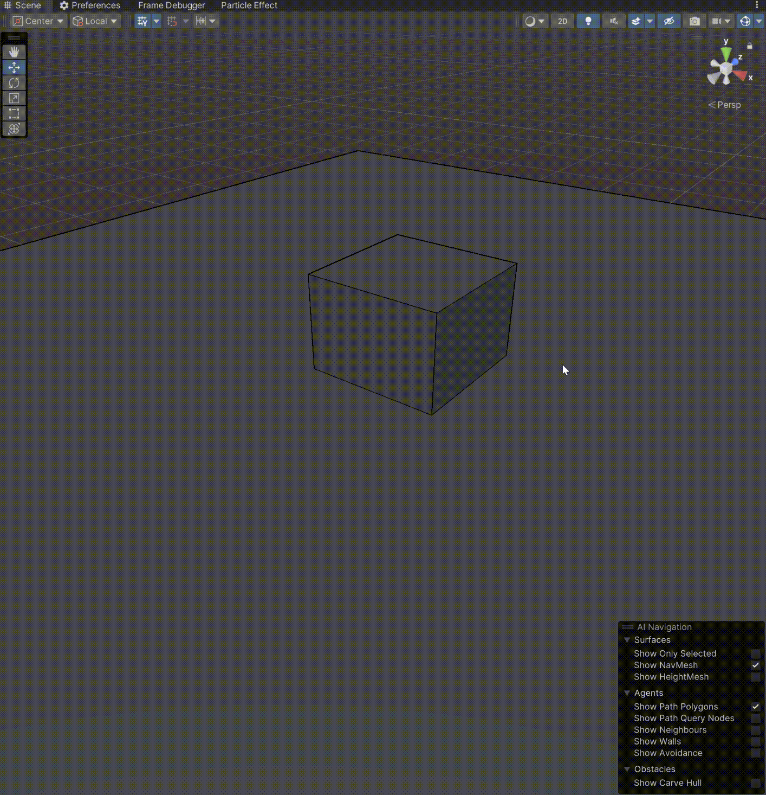

# DrawModePlusMLS
github:

https://github.com/MlsMoon/DrawModePlusMLS

UnityDrawMode拓展插件

# Unity版本
目前测试了
2022.3.62f3版本,默认管线设置
暂时不支持延迟或移动端管线

# 拓展的SceneView视图
## Depth视图
<figure>
  
  <figcaption>开启Depth视图</figcaption>
</figure>