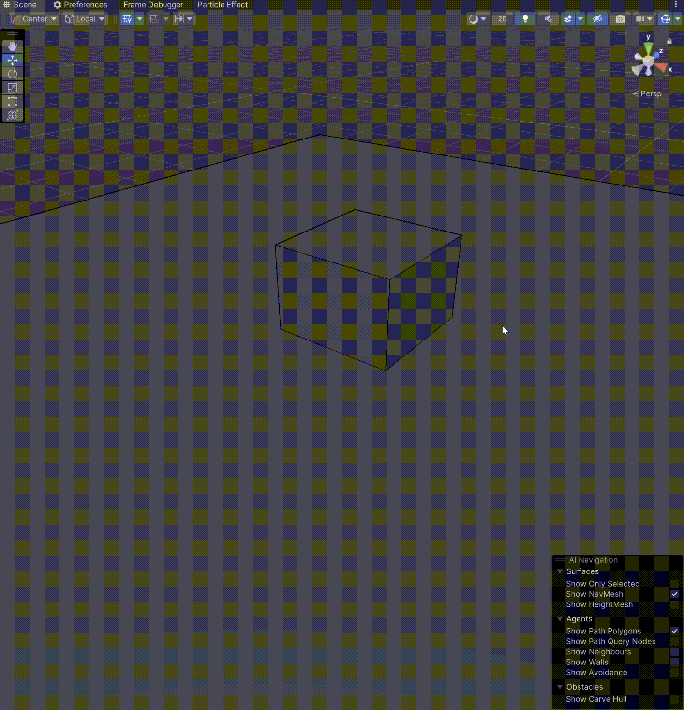
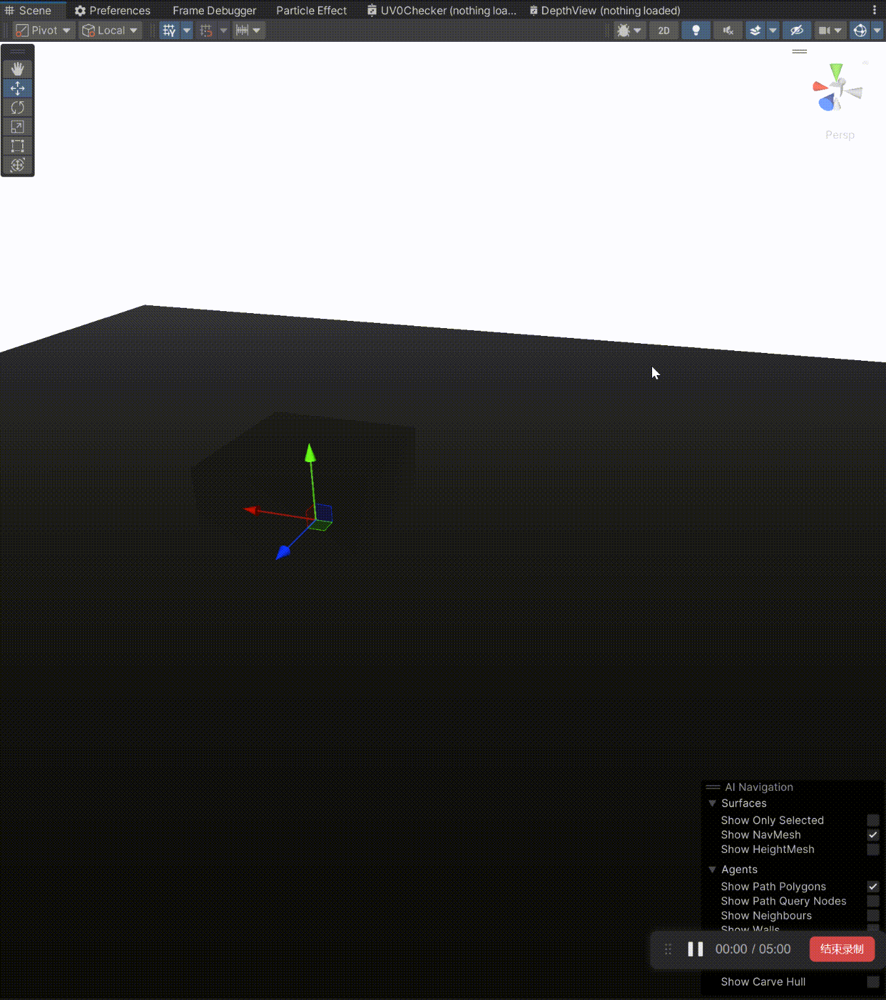
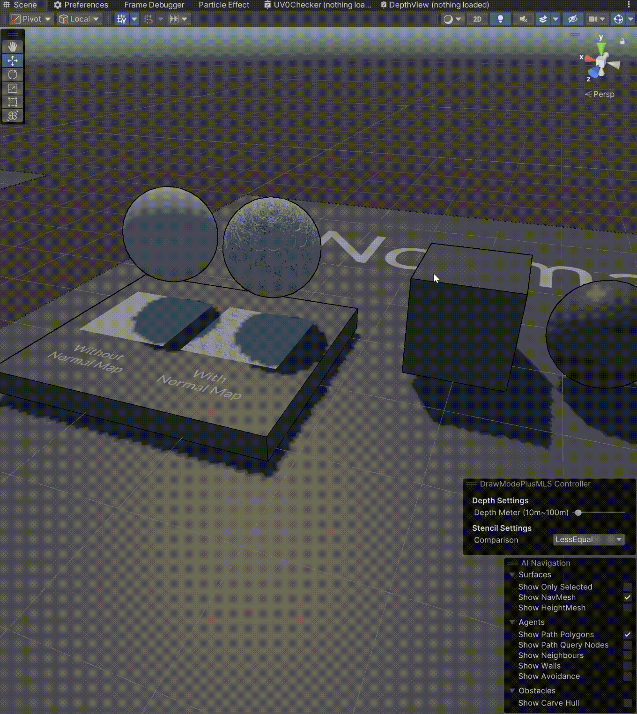
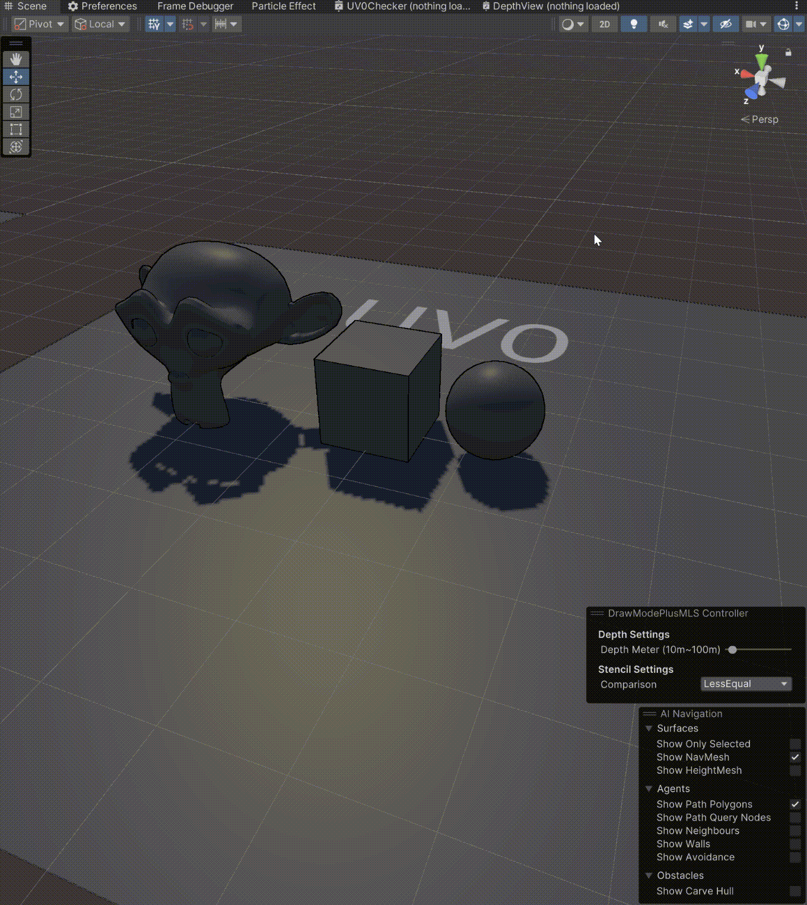

# DrawModePlusMLS

English | [简体中文](Docs/README.zh-Hans.md)

Extra SceneView debug draw modes for [Universal Render Pipeline](https://docs.unity3d.com/Packages/com.unity.render-pipelines.universal@14.0/manual/index.html). Inspect depth, normals, UVs, GBuffer channels, texel density, stencil, and reflection probes from the SceneView camera dropdown.

> The plugin is editor-only. It auto-injects a URP Renderer Feature, then redraws or blits debug views without changing gameplay materials.

**Agents:** start at [`AGENTS.md`](AGENTS.md). Skills (Unity-ignored) live in [`Skills~/`](Skills~/README.md). Machine-readable index: [`llms.txt`](llms.txt). Do not invent APIs from older README copies — `AGENTS.md` is the current-contract override.

## Requirements

- Unity 2022.3+ (tested on 2022.3.62f3)
- Universal Render Pipeline (URP) 14
- **URP only** — Built-in and HDRP are not supported
- Forward and Deferred rendering paths

## Quick Start

1. Install the plugin (see [Installation](#installation)).
2. Open a SceneView.
3. Open the **Draw Mode** dropdown (top-left, usually `Shaded`).
4. Scroll to the **DrawModePlusMLS** section and pick a mode.

Optional: `Tools > DrawModePlus > Draw Mode Control Panel` for a dockable switcher, Depth range slider, and Reflection Force Mirror / Global Roughness controls.

On first editor load the plugin injects `DrawModePlusRendererFeature` into every URP Renderer Data asset. No manual Renderer Feature setup is required.

## Installation

### Copy into `Assets/`

Copy the `DrawModePlusMLS` folder anywhere under your project's `Assets/` (for example `Assets/Plugins/DrawModePlusMLS`).

### Unity Package Manager (Git)

In Unity: **Window > Package Manager > + > Add package from git URL**

```text
https://github.com/MlsMoon/DrawModePlusMLS.git
```

Pin a commit or tag if you need a fixed revision:

```text
https://github.com/MlsMoon/DrawModePlusMLS.git#v0.2.0
```

The package id is `com.mlsmoon.drawmodeplus`. After import, wait for script compile, then open a SceneView.

### After install

1. Confirm the Console has `DrawModePlusMLS: Injected DrawModePlusRendererFeature into ...` (once per Renderer Data).
2. Select a mode from the SceneView dropdown or the control panel.
3. Optional: enable **Enable Game View** on the injected Renderer Feature if you also want Game cameras.

## Features

| Mode | Path | Description |
|---|---|---|
| **Depth** | Forward / Deferred | Fullscreen depth. Range slider 1–500 m. |
| **WorldNormal (Forward)** | Forward | World-space normals via a fullscreen pass. |
| **WorldNormal (Deferred)** | Deferred | GBuffer normals, including normal maps. |
| **BaseColor (Deferred)** | Deferred | GBuffer albedo. |
| **MaterialAO** | Deferred | GBuffer ambient occlusion. |
| **Metallic (Deferred)** | Deferred | GBuffer metallic. |
| **Roughness (Deferred)** | Deferred | GBuffer roughness (from smoothness). |
| **TexelDensity** | Forward / Deferred | Re-draws objects that expose `DrawModePlusTexelDensity`. Color legend: ≤128 red, 256 orange, 512 green, 1024 cyan, ≥2048 blue. Gray = shaders without the pass. **Host shaders must opt in.** |
| **UV0** | Forward / Deferred | UV0 checker overlay on scene objects. |
| **Stencil** | Forward / Deferred | Writes stencil, then visualizes it with a blit. |
| **Reflection** | Forward / Deferred | Clears the camera and redraws with `DrawModePlus/ReflectionView`. Samples per-object Probe/Sky from mesh normals. **Force Mirror** (default) is chrome. Turning it off uses one global roughness, not the original material. Objects without `UniversalForward` / `UniversalGBuffer` / `UniversalForwardOnly` / `SRPDefaultUnlit` are skipped, same as UV0. |

## Screenshots

| Depth | Depth range | World Normal | UV0 |
|---|---|---|---|
|  |  |  |  |

## Reflection Mode

Reflection is a Renderer Feature override, not URP Lighting Debug:

- Clears the color target, then `DrawRenderers` with `DrawModePlus/ReflectionView`
- Original materials and other host debug views do not write this buffer
- **Force Mirror** (default): perceptual roughness = 0, chrome IBL for every object
- Force Mirror off: one global roughness slider; still not the original material roughness
- Uses mesh normals and per-object `unity_SpecCube0` / Box Projection
- Screen-space reflections from other features are not included. Use that feature's own debug view if you need SSR isolation

## TexelDensity — host shader integration

Without a `LightMode = "DrawModePlusTexelDensity"` pass, objects render flat gray.

```hlsl
Pass
{
    Name "DrawModePlusTexelDensity"
    Tags { "LightMode" = "DrawModePlusTexelDensity" }

    HLSLPROGRAM
    #pragma vertex Vert
    #pragma fragment Frag

    half4 Frag(Varyings input) : SV_Target
    {
        float2 uv = input.uv0;
        float2 ddxUV = ddx(uv);
        float2 ddyUV = ddy(uv);
        float texelDensity = /* texels per world unit */;
        float normalizedDensity = texelDensity / 512.0;
        return half4(normalizedDensity, normalizedDensity, normalizedDensity, 1.0);
    }
    ENDHLSL
}
```

`TexelDensityDebugPass` draws with `ShaderTagId("DrawModePlusTexelDensity")`. Missing tags fall back to `DrawModePlus/FlatGray`.

Legend (bottom of SceneView):

```text
Texel Density 512/m | <=128 Low | 256 Low | 512 OK | 1024 High | >=2048 High | Gray = non-integrated shader
```

Full shader notes: `Skills~/drawmodeplus-use-plugin/references/texel-density.md`.

## Shaders

Shipped in `Arts/Shaders/` and resolved with `Shader.Find` by name. They do **not** have to live in a `Resources` folder; they must stay in the imported plugin so Unity can find them.

| Shader | Purpose |
|---|---|
| `DrawModePlus/DepthView` | Depth fullscreen pass |
| `DrawModePlus/WorldNormal` | Forward normals |
| `DrawModePlus/DeferredNormalBuffer` | Deferred normal buffer |
| `DrawModePlus/DeferredDebugView` | Deferred GBuffer (BaseColor / Metallic / Roughness / AO) |
| `DrawModePlus/UV0Checker` | UV0 checker |
| `DrawModePlus/FlatGray` | TexelDensity fallback |
| `DrawModePlus/StencilWriter` | Stencil write |
| `DrawModePlus/StencilChecker` | Stencil visualization |
| `DrawModePlus/ReflectionView` | Override chrome / IBL redraw |

## Example

Open `Example/Demo.unity` after the Renderer Feature has been injected. Sample meshes, materials, and the NormalMap prefab live under `Example/` and `Arts/`. See `Example/README.md`.

## Layout

```text
DrawModePlusMLS/
├── Runtime/                 URP Renderer Feature, state, debug passes
├── Editor/                  SceneView modes, control panel, auto-inject
├── Arts/                    Shaders, materials, textures
├── Example/                 Demo scene and sample prefabs
├── Docs/                    Translations and screenshot GIFs
├── Skills~/                 Agent skills (Unity-ignored)
├── AGENTS.md                Agent router and current contract
└── README.md
```

## Agent skills

`Skills~/` (Unity-ignored `~` folder):

- `drawmodeplus-use-plugin` — install, modes, texel-density integration, troubleshooting
- `drawmodeplus-develop-plugin` — architecture, adding a mode, verification

Copy a skill folder into the host `.agents/skills/` or `.cursor/skills/` if the agent only auto-loads those paths. In this repository, read `AGENTS.md` first.

## Contributing

See [`CONTRIBUTING.md`](CONTRIBUTING.md). Please read `AGENTS.md` before editing Runtime or Editor code.

## License

MIT — see [`LICENSE`](LICENSE). Third-party sample assets are listed in [`THIRD_PARTY.md`](THIRD_PARTY.md).
